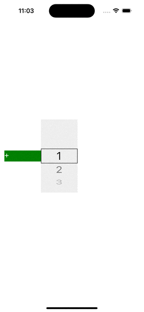

# react-native-wheel-picker-purejs

## this is wheel picker with pure ts code



# Usage

```tsx
export default function App() {
    const [selectIndex, setSelectIndex] = React.useState<number>(0);

    return (
        <View>
            <WheelPicker
                visibleNum={2}
                textStyle={{ fontSize: 30 }}
                wheelWidth={100}
                itemHeight={40}
                data={[
                    '1',
                    '2',
                    '3',
                    '4',
                    '5',
                    '6',
                    '7',
                    '8',
                    '9',
                    '10',
                    '11',
                    '12',
                ]}
                selectIndex={selectIndex}
                onChange={(idx) => {
                    setSelectIndex(idx);
                    console.log(`idx ${idx}`);
                }}
            />
        </View>
    );
}
```

